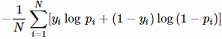

# Machine Learning Engineer Nanodegree
## Capstone Proposal
Charlie Garavaglia  
January 19, 2018

## Proposal

### Domain Background

This project is taken from a Kaggle competition, the [Statoil/C-CORE Iceberg Classifier Challenge](https://www.kaggle.com/c/statoil-iceberg-classifier-challenge), ongoing as of the above date.

From the description:

> Drifting icebergs present threats to navigation and activities in areas such as offshore of the East Coast of Canada.
> 
> Currently, many institutions and companies use aerial reconnaissance and shore-based support to monitor environmental conditions and assess risks from icebergs. However, in remote areas with particularly harsh weather, these methods are not feasible, and the only viable monitoring option is via satellite. 
> 
> Statoil, an international energy company operating worldwide, has worked closely with companies like C-CORE. C-CORE have been using satellite data for over 30 years and have built a computer vision based surveillance system. To keep operations safe and efficient, Statoil is interested in getting a fresh new perspective on how to use machine learning to more accurately detect and discriminate against threatening icebergs as early as possible.
> 
> In this competition, you’re challenged to build an algorithm that automatically identifies if a remotely sensed target is a ship or iceberg. Improvements made will help drive the costs down for maintaining safe working conditions.

Much like the "blips" on ships' radar in the movies, objects in the ocean are returned to the Sentinel-1 satellite as a bright spot on its Synthetic Aperature Radar (SAR) image. This is because solid objects reflect back the radar energy emitted by Sentinel-1 more strongly than its surroundings. In this way, solid objects in a ship's path can be detected, although further analysis is needed to correctly identify the object. 

In our case, we a given the challenge of discriminating between ocean-going ships and icebergs. A [recent article from the European Space Agency](http://www.esa.int/Our_Activities/Observing_the_Earth/Satellites_guide_ships_in_icy_waters_through_the_cloud) shows the benefits from such an implementation; the ability to "navigate through...notoriously icy waters". Our approach will leverage deep learning and convolutional neural networks (CNNs) to help automate the discrimination process. A similar approach applied to the same problem is outlined by [Bentes, Frost, Velotto, and Tings (2016)](http://elib.dlr.de/99079/2/2016_BENTES_Frost_Velotto_Tings_EUSAR_FP.pdf), even being written in Python using the library Theano. However, their radar images were higher resolution, so my solution will differ by inputs given to the model, preprocessing and normalization methods, and a larger CNN architecture. 

This project has a personal connection for me as I worked with imagery data in a previous job and never quite connected with how to interact with it. As a capstone it represents how far I have come since losing that job. 

### Problem Statement

The aim of the competition is to distinguish an iceberg from a ship in satellite radar data, specifically images from the Sentinel-1 satellite constellation's C-Band radar. Each image provided contains only an iceberg or an ocean-going ship. Thus, labeling each entry in the test set as 0 for ship or 1 for iceberg is perfectly reasonable, as is producing a probability that the image contains an iceberg. Thus the problem is quantifiable. Indeed, each submission is measured using the [log loss](https://www.kaggle.com/wiki/LogLoss) between our predicated probability values (of presence of an iceberg) versus ground truth. For difficult classification cases we cannot clearly observe the ground truth, but must rely on provided verification; in any case, the problem is measurable. Finally, this problem is replicable so long as there are icebergs and ships floating in the sea and satellites to take pictures of them. 

Thus, overall, we may view this as a binary classification problem: iceberg or not an iceberg?

A detailed background can be found on the [Kaggle Background page](https://www.kaggle.com/c/statoil-iceberg-classifier-challenge#Background). 

### Datasets and Inputs

Training and testing data are provided in `json` format. Each entry in `train.json` and `test.json` represents an image composed of radar data. The satellite transmits a radar pulse and then records the echo of that radar bouncing off objects. This energy reflected back to the satellite is referred to as _backscatter_. Additionally, this particular satellite has side looking radar, and thus views its areas of interest at an angle, rather directly down. This angle is called the _incidence angle_, and the background page linked above has the interesting note that "generally, the ocean background will be darker at a higher incidence angle". Finally, Sentinel-1 can transmit and receive radar energy in different planes. This is called the _polarization_ of the radar band.

An entry in `train.json` and `test.json` contains the following fields:

* __`id`__ = ID of the image, for matching purposes
* __`band_1`, `band_2`__ = list of flattened image data in two bands. Each band is a 75x75 pixel image, so each list has 5625 elements. Values are decibels (dB) of radar backscatter at a given incidence angle and polarization. The polarization of `band_1` is HH, where the radar is transmitted and received in the horizontal plane. The polarization of `band_2` is HV, i.e. transmitted horizontally and received vertically. 
* __`inc_angle`__ = incidence angle of radar image. Some entries have missing data and are marked as `na`.
* __`is_iceberg`__ = target variable: 1 if iceberg, 0 if ship. This field exists only in `train.json`

`train.json` contains 1604 images while `test.json` has 8424. Of the 1604 training images, 133 have missing incidence angles. These will be replaced with numpy NaN markers; if this is not compatible in keras, then I will make use of scikit-learn's [Imputer class](http://scikit-learn.org/stable/modules/generated/sklearn.preprocessing.Imputer.html) to fill the null values (basically filling by the mean, median, or mode of the incidence angle). An alternative would be to predict the incidence angle from the bands of radar imagery, but that might be needlessly complex and of dubious (or at least unknown) predictive value. 

Our target variable `is_iceberg` is fairly balanced. There are 851 ships and 753 icebergs in the training set; that is, about 46.9% of the images contain an iceberg. See below code:

```python
import pandas as pd

df_train = pd.read_json('train.json')
ship, ice = df_train.is_iceberg.value_counts()
avg_train_iceberg = ice / (ship+ice))
# 0.4694513715710723
```

### Solution Statement

Employing computer vision to detect if an object is in an image should solve the problem. This can be accomplished by building a CNN and then training it on many labeled images containing (and not containing) the desired object, in our case the iceberg. Once trained, a probability that the image contains an iceberg can be outputted, thus the solution is quantifiable, measurable, and since the CNN can be used on many images, it is also replicable. 

### Benchmark Model

We know a perfect classifier would have a log loss of exactly zero, but we don't know how an unintelligent classifier would fare. Three such classifiers jump to mind: one that always classifies an image as containing an iceberg at probability 1.0, one that always outputs iceberg probability 0.5, and one that's certain there's never an iceberg anywhere (iceberg probability = 0.0). An additional classifier is one that predicts an iceberg in an image equal to the frequency of icebergs in the training set, aka `avg_train_iceberg` above. These naive classifiers as benchmark models are the best option at the moment, as the paper presented in the introduction used an F1-score evaluation metric and because the competition ends so soon. 

We must submit each to the [Kaggle submission page](https://www.kaggle.com/c/statoil-iceberg-classifier-challenge/submit) for calculation of log loss, as we do not have access to the true labels of the testing data. 

|           Baseline Model           | `is_iceberg =` | log loss (private/public)|
|------------------------------------|----------------|-------------------------:|
| certain iceberg                    | 1.0            |          16.3468/16.5210 |
| certain not iceberg                | 0.0            |          18.1922/18.0180 |
| indecisive                         | 0.5            |            0.6931/0.6931 |
| proportion of icebergs in training | 0.469451       |            0.6982/0.6976 |

As a comparison:

| Model          | Log Loss |
|----------------|----------|
| current leader | 0.0869   |

(Actually, there's a limit of 2 submissions per day, so the baseline model table will remain unfilled unless I have enough days before the close of the contest. This limitation at present unfortunately precludes the other approach for a benchmark model, which is obtaining the log loss from a vanilla neural network.)

Worth noting is that the log loss will change after the competition concludes. According to the [Kaggle leaderboard site](https://www.kaggle.com/c/statoil-iceberg-classifier-challenge/leaderboard), "[The] leaderboard is calculated with approximately 20% of the test data. The final results will be based on the other 80%, so the final standings may be different."

### Evaluation Metrics

As mentioned, the official evaluation metric is the logarithmic loss, or "log loss", of our predictions. If our prediction matches the ground truth, a confident prediction probability will contribute little to the total log loss. However, if our prediction does not match, a confident incorrect prediction will contributed heavily to the log loss. We shall endeavor to minimize the log loss; a perfect classifier (that outputs 1.0 for all iceberg images and 0.0 for all non-iceberg images) would have a log loss equal to zero. 

Such a metric is appropriate as it distinguish performance from models who output the same classification scheme for the same dataset. When combined with an accuracy metric for private use, we can derive some insight into how our model is performing. 

Detailed explanations of log loss are [available online](http://www.exegetic.biz/blog/2015/12/making-sense-logarithmic-loss/), but below is the log loss formula for a binary classifier:

&nbsp;&nbsp;&nbsp;&nbsp;&nbsp;

where _y<sub>i</sub>_ is the ground truth for image _i_ (_y<sub>i</sub>_ = 1 for iceberg, _y<sub>i</sub>_ = 0 if no iceberg), _p<sub>i</sub>_ is the computed probability that image _i_ contains an iceberg, and _N_ is the total number of images. 

Note that for each image, only one side of the logs adds to the total log loss. 

### Project Design

##### Data Preparation

The `train.json` file will unpacked and loaded into a pandas DataFrame. The features will be separated from the labels, the former into a `X_train` vector and the later to a `y_train` one. The null values in the training set in `inc_angle`, currently the string `'na'`, will be set to `np.nan` or the mean/median/mode incidence angle. 

Example 2D hotspot or 3D plots of images containing an iceberg and a ship will be constructed and displayed. 

##### Preprocessing Images

First, a third channel called `band_3` will be added to each image equal the average between `band_1` and `band_2`. Then, the three bands of the radar image must be reshaped into 75x75 pixel image and packaged into the 4D tensors that a `keras` CNN expects. 

Finally, the data from each picture will be normalized by subtracting the mean decibel value and dividing by the band's standard deviation. Furthermore, data augmentation will be employed to enlarge the training set, thereby hopefully gaining more predictive power. Additionally, [histogram equalization](https://towardsdatascience.com/image-augmentation-for-deep-learning-using-keras-and-histogram-equalization-9329f6ae5085) will be explored as a possible preprocessing function. All will be accomplished by using an instance of the [`ImageDataGenerator`](https://keras.io/preprocessing/image/) class in `keras`. 

##### Model Overview

I will endeavor to employ a `keras` CNN for image classification to recognize icebergs in the radar data. Much like the dog project, I will employ successive convolutional and max pooling layers to deepen the spatial information while decreasing the spatial dimension of each image. Further, dropout and batch normalization layers will be employed to combat overfitting. This output of an encoded image will be concatenated with the incidence angle before sending it to multiple layers of fully-connected nodes to illuminate any patterns in the data. Finally, a single node with a sigmoid activation will output the probability that the image "contains iceberg". This probability will be compared to the true class label for every prediction, and the log loss will be reported by Kaggle. 

##### CNN Architecture

The CNN architecture will follow suggested designs and consist of 3-4 successive [`Conv2D`](https://keras.io/layers/convolutional/#conv2d) and [`MaxPooling2D`](https://keras.io/layers/pooling/#maxpooling2d) layers, with overfitting-fighting `Dropout` layers sprinkled in. I am partial to a convolutional window of at least 3x3 or 4x4, and a pooling size of at least 2 or 3, but will bow to the best performance after successive runs. All activations on these layers will be `relu` following current best practices. I am also considering adding [`BatchNormalization`](https://keras.io/layers/normalization/#batchnormalization) layers as the image data will pass through many layers and filters. The amount of filters will be higher than the dog project, as I have a desktop with a GPU capable of integrating with `keras` and the `TensorFlow` backend. Hopefully this will lead to better predictive power. 

After the spatial dimensions are shrunk and the spatial information deepened, the image will be transformed into a vector by using a `Flatten` layer. Now, the encoded image vector and the incidence angle will be passed to a [concatenate layer](https://keras.io/layers/merge/#concatenate_1) to allow 2 inputs to the fully connected layers. These will then be inputted to at least 2 layers of [`Dense`](https://keras.io/layers/core/#dense) layers also with `relu` activations. This neural net will serve to elucidate any hidden patterns in the data, while also considering the effect of the incidence angle on the radar image channel values. 

A final `Dense` node with a `sigmoid` activation will output the desired probability. 

The number of training epochs will be arbitrary, as training will be stopped using an [`EarlyStopping`](https://keras.io/callbacks/#earlystopping) checkpoint to determinate when validation loss has stopped improving, and the best model will be saved using [`ModelCheckpoint`](https://keras.io/callbacks/#modelcheckpoint). 

##### Model Fit and Testing

Once the CNN is compiled using `binary_crossentropy` (aka log loss) as the loss function, an appropriate optimizer such as `rmsprop` or `adam` (further investigation needed), and `accuracy` as the metric for convenience, we can then use it for training. 

Since we've created an `EarlyStopping` and `ModelCheckpoint` callback, as well as a `ImageDataGenerator`, we can pass in the appropriate values to `.fit_generator` to actually fit the CNN on the training data. A training/validation split will be specified, and the validation log loss monitored to see when our model is sufficiently trained but not overfitting.

All that's left is to load the model with the best validation loss saved by the `ModelCheckpoint`, and then call [`.predict`](https://keras.io/models/sequential/#sequential-model-methods) on the test images to output the probability that the test image contains an iceberg. Once obtained, we simply package our results into a csv with two columns, `id` and `is_iceberg`, submit it to Kaggle, and await our log loss results. 

Possibly we could have some tea, warmed by the knowledge that we've helped determine where icebergs are in the ocean. 