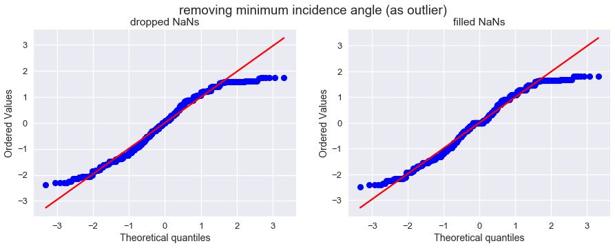

# Machine Learning Engineer Nanodegree
## Capstone Project
Charlie Garavaglia  
March 5, 2018

## I. Definition

### Project Overview
This project constitutes an entry in a Kaggle competition, the [Statoil/C-CORE Iceberg Classifier Challenge](https://www.kaggle.com/c/statoil-iceberg-classifier-challenge). 

From the description:

> Drifting icebergs present threats to navigation and activities in areas such as offshore of the East Coast of Canada.
> 
> Currently, many institutions and companies use aerial reconnaissance and shore-based support to monitor environmental conditions and assess risks from icebergs. However, in remote areas with particularly harsh weather, these methods are not feasible, and the only viable monitoring option is via satellite. 
> 
> Statoil, an international energy company operating worldwide, has worked closely with companies like C-CORE. C-CORE have been using satellite data for over 30 years and have built a computer vision based surveillance system. To keep operations safe and efficient, Statoil is interested in getting a fresh new perspective on how to use machine learning (ML) to more accurately detect and discriminate against threatening icebergs as early as possible.
> 
> In this competition, you’re challenged to build an algorithm that automatically identifies if a remotely sensed target is a ship or iceberg. Improvements made will help drive the costs down for maintaining safe working conditions.

Much like the "blips" on ships' radar in the movies, objects in the ocean are returned to the Sentinel-1 satellite as a bright spot on an image from its Synthetic Aperture Radar (SAR). The satellite transmits a radar pulse and then records the echo of that radar bouncing off solid objects, which reflect back the energy emitted by Sentinel-1 more strongly than its surroundings (since in technical language, solid objects have a higher _reflectance_). The radar energy collected by the satellite is referred to as _backscatter_ and its intensity makes up the radar images presented herein. Additionally, this particular satellite is equipped with "side looking radar", and thus views its areas of interest at an angle, rather from directly above. This angle, measured perpendicularly from the earth's surface to the area of interest, is called the _incidence angle_ of the satellite. It is noted in the competition background information that "generally, the ocean background will be darker at a higher incidence angle". Finally, Sentinel-1 can transmit and receive radar energy in different planes. The combination of transmission plane and receiving plane is called the _polarization_ of the radar band.   

After identification on the SAR image described above, analysis is required to correctly identify the remotely sensed object. In our case, we are given the task of discriminating between ocean-going vessels and floating icebergs, which pose a significant danger. A [recent article from the European Space Agency](http://www.esa.int/Our_Activities/Observing_the_Earth/Satellites_guide_ships_in_icy_waters_through_the_cloud) exposes the apparent benefits from such technology: the ability to programmatically detect threats to shipping and "navigate through...notoriously icy waters". The approach presented in this paper will leverage deep learning and convolutional neural networks (CNNs) to learn what which features of a radar image determine an iceberg. A similar approach applied to the same problem is outlined by [Bentes, Frost, Velotto, and Tings (2016)](http://elib.dlr.de/99079/2/2016_BENTES_Frost_Velotto_Tings_EUSAR_FP.pdf), going as far to also be written in Python, but using the ML library Theano. The solution presented here will differ by preprocessing methods, the extra feature of the incidence angle, the software backend supporting the neural network (TensorFlow via Keras), and the specific CNN architecture employed to perform the classification. 

My prediction is that best results will come with a custom architecture using the Bentes normalization, since we don't have access to his architecture but his methods seem sound. 

#### Input Data

To help accomplish our task, Statoil and C-CORE have provided us with two `json` files, one of labeled training examples (`train.json`) and one of unlabeled examples to test our model on (`test.json`). Each entry in both essentially contains a 75x75 pixel image composed of the backscatter levels from two different polarizations, along with the incidence angle the radar was emitted/collected at, and a label, if applicable. 

### Problem Statement

The aim of the competition is to distinguish an iceberg from a ship in satellite radar data, specifically images from the Sentinel-1 satellite constellation's C-Band radar. Each image provided contains only an iceberg or an ocean-going ship. Thus, labeling each entry in the test set as 1 for iceberg and 0 for ship (or not-iceberg) is perfectly reasonable, as is producing a probability that the image contains an iceberg.

Thus, overall, we may view our task as a binary classification problem: does an image contain an iceberg or not? 

#### Solution Strategy

Employing computer vision to detect if an object in an image is a well-supported approach to this problem. This can be accomplished by building a CNN and training it on the data to recognize features of our label, in our case an iceberg. See [Hasanpour et al (2018)](https://arxiv.org/pdf/1802.06205.pdf), [Springenberg, Dosovitskiy, et al (2015)](https://arxiv.org/pdf/1412.6806.pdf) and others for numerous applications of CNNs for object detection. Once trained, a probability that a radar image contains an iceberg can be outputted. 

### Metrics

The official evaluation metric of this Kaggle competition is the logarithmic loss, or "log loss", of our predictions. Also referred to by  "binary cross-entropy" in ML, this is a suitable metric, as it gives a notion of distance from our outputted probabilities (a number between 0 and 1) to the actual label, which is either a 0 or a 1.

Detailed explanations of log loss are [available online](http://www.exegetic.biz/blog/2015/12/making-sense-logarithmic-loss/), but the formula for log loss is presented here:

$$-\frac{1}{N} \sum\limits_{i=1}^N {y_i \log p_i + (1 - y_i) \log (1 - p_i)}$$

where $y_i$ is the label (1 = iceberg, 0 = no iceberg) for image $i$, $p_i$ is the probability outputted by our model that image $i$ contains an iceberg, and $N$ is the total number of images.

The individual log loss is summed and divided by $-N$ to give a comparable metric between predictions of different size and in order to make the log loss positive to preserve the notion of minimizing loss. 

For a single image, if our prediction matches the label, a confident prediction probability will contribute little to the total log loss. However, if our prediction does not match, a confident incorrect prediction will contributed heavily to the log loss. We shall endeavor to minimize the log loss; a perfect classifier (that outputs 1.0 for all iceberg images and 0.0 for all non-iceberg images) would have a log loss equal to zero. 

In practice, functions that calculate log loss do not directly compute predictions of exactly 1 or 0. You might notice that a perfectly wrong prediction, such as predicting a definite in image $j$ containing a ship ($y_j = 1$) with probability $p_j = 0$ involves the calculation $y_j \log p_j = 1 \log 0 = \inf$. Since we can't sum infinity meaningfully, the log loss function assigns a minimum and maximum probability that it sets predictions of 0.0 and 1.0 to, respectively.

## II. Analysis

### Data Exploration

The dataset is provided by Statoil, an international energy company, C-Core, who built the satellite computer vision system we are endeavoring to improve upon, with delivery provided by the good people at [Kaggle](https://www.kaggle.com/). 

The two `json` files, named **`train.json`** and **`test.json`**, divide the data into training and testing sets respectively. They are identical except the latter does not have a `is_iceberg` column and is much larger than the former. 

For completeness, an entry in `train.json` and `test.json` contains the following fields:

* __`id`__ = ID of the image, for matching purposes
* __`band_1`, `band_2`__ = list of flattened image data in two bands. Each band is a 75x75 pixel image, so each list has 5625 elements. Values are decibels (dB) of radar backscatter at a given incidence angle and polarization. The polarization of `band_1` is HH, where the radar is transmitted and received in the horizontal plane. The polarization of `band_2` is HV, i.e. transmitted horizontally and received vertically. 
* __`inc_angle`__ = incidence angle of radar image. Some entries have missing data and are marked as `na`.
* __`is_iceberg`__ = target variable: 1 if iceberg, 0 if ship. Again, this field exists only in `train.json`

There are 851 (53.05%) training examples of ships and 753 (46.95%) training examples of icebergs. 

This means that (1) we must create our own validation set from the smallish dataset, and since this doesn't leave us with a lot of training examples, we must therefore (2) find ways to augment the training set with `keras` methods to improve the model's predictive power. 

#### Radar Data

As noted in the introduction, a radar band's image data is composed of the decibel levels of backscatter, equivalent to the intensity of the reflected radar pulse for some predetermined pixel-to-area conversion. See below for heatmapped 2D illustrations:
##### Before By-Image Normalization

##### After By-Image Normalization

Both above are examples of the `band_1` aka transmit/receive horizontally (HH) radar data. We choose one of the icebergs and display its Q-Q plot, which measures the data's normal distribution tendencies. 

##### Normalization by Image

Note that it is somewhat normally distributed, but the bright spots of the area of interest (i.e. the iceberg or ocean-going vessel) makes it more heavily right-tailed. For our first pass, we are going to leave the normalized values where they are and observe performance. 

Also to note is that we will be normalizing over each band, rather than by pixel across the entire dataset. This is for the now obvious reason that the backscatter from the icebergs' and ships' areas of interest are not fixed (since icebergs are, in fact, not uniformly made). Therefore the model should learn to expect edges in different places in the image. 

Finally, we must add a third channel set to the mean of `band_1` and `band_2`, since Keras expects 1- or 3-channeled images (equivalent to grayscale or RGB images). This is accomplished through the `process_df` function applied early in the Jupyter notebook. 

#### Incidence Angle

Since this is side-looking radar from a satellite, backscatter levels can be affected by the viewing and receiving angle, which may be important to include in our model's analyses. 

Kaggle alerts us to the fact that the training data involves a number of missing incidence angles, all occurring when the image contains an ocean-going vessel. See below. 

After classifying them as `np.NaN`, a decision must be made on how to handle the missing data. At this juncture, filling the missing incidence angles with the mean of incidence angles from ships only seems like a reasonable first step. 

Next, a minimum value is well away from the normalized values when viewed on a Q-Q plot. 

I chose to drop this minimum incidence angle as an outlier and fill the missing angles, since the training set is on the smaller size anyway. You can see the effects on the following Seaborn distplot: 

What we are left with is a somewhat normal-ish looking distribution which hopefully strikes the balance between lack of data and working within Keras limitations. 

### Exploratory Visualization

I invite you to explore an interactive surface plot of an iceberg or ship thanks to `plotly` and [this helpful Kaggle notebook](https://www.kaggle.com/devm2024/keras-model-for-beginners-0-210-on-lb-eda-r-d).

Interactive features are located in the [project report notebook](../project_notebook.ipynb), but below is a static view.  

### Algorithms and Techniques
The approach employed will largely mirror cited articles. After pre-processing and normalization techniques are applied, a convolutional neural network, or CNN, will be constructed and trained on the labeled radar images. This is the computer vision industry standard approach to object recognition in images. 

Generally, a CNN works by creating some combination of layers specific to CNNs. 

The first and most important for detecting edges and shapes are the convolutional layer. This is usually a square filter slid across and down the image radar images that learns the shapes associated with that particular label (i.e. 0 for ship and 1 for iceberg). This deepens the spatial information available on a particular pixel. The second notable layer is a pooling layer, which averages or maxes a subset of usually >= 2x2 pixels on the radar image. This layer of the CNN usually follows a convolutional layer and works to shrink the dimensions of the informational object, while keeping the deepness that the convolution added. Finally, the other layer to be conversant in is the dropout layer, which randomly turns off some neurons in the network so that all of the architecture can be trained. This can be thought as "turning off" your dominant hand to learn how to sign your name with your off-hand, but in the case of nodes in a network. The theory is that, unlike a person, a fully-utilized neural network will generalize better than one with "asleep" nodes. 

**ADD SUMMARY OR EXPLANATION OF SIMPNET HERE** 

SimpNet, like most CNN architectures, works because it does, rather than some application of theory (). A custom CNN build scored better, but that code was lost in a freak git accident. SimpNet was found for its accuracy on the **WHATEVER DATABASE** and its block-like design, allowing for meta-learning refinement later. 

In the paper, 

**END OF SIMPNET DISCUSSION**

Also to note is that we haven't mentioned the incidence angles yet. If we went through the trouble of filling the missing angles, we might as well use them in our initial analysis, right? 

To address this, we must use the functional model of Keras to combine the output of the CNN with the scaled incidence angle using a `concatenate` layer. This allows multiple inputs to be combined in a single layer, which will then be fed forward to the fully connected layers for further analysis. 

### Benchmark
To benchmark our solutions locally, we rely on the performance of a "vanilla" neural network. This non-CNN has a few layers of fully-connect nodes and outputs the same probability values that our CNN will. By uploading to Kaggle and viewing its log loss, we obtain a baseline from which to iterate upon. 

Furthermore, baseline model results have been calculated from setting outputted probabilities to specific values:

> We know a perfect classifier would have a log loss of exactly zero, but we don't know how an unintelligent classifier would fare. Three such classifiers jump to mind: one that always classifies an image as containing an iceberg at probability 1.0, one that always outputs iceberg probability 0.5, and one that's certain there's never an iceberg anywhere (iceberg probability = 0.0). An additional classifier is one that predicts an iceberg in an image equal to the frequency of icebergs in the training set 
> 
>We must submit each to the [Kaggle submission page](https://www.kaggle.com/c/statoil-iceberg-classifier-challenge/submit) for calculation of log loss, as we do not have access to the true labels of the testing data. 

We have since taken as gospel the fact that the leaderboard is calculated with the private score which is 80% of the data and combined it with the public score which is calculated with 20% of the data. Even though it's not explicit that the intersection of these two subsets is non-empty, we pretend it is. 

|           Baseline Model           | `is_iceberg =` | Log Loss |
|------------------------------------|----------------|---------:|
| certain iceberg                    | 1.0            | 16.38164 |
| certain not iceberg                | 0.0            | 18.15736 |
| indecisive                         | 0.5            |   0.6931 |
| proportion of icebergs in training | 0.469451       |  0.69808 |

As a comparison:

| Model          | Log Loss (private 80%) |
|----------------|------------------------|
| leader         | 0.0822                 |

The `certain iceberg` and `certain not iceberg` baseline models can be thought of as the worst we can do, without having access to the labels and guessing completely wrong each time. We can infer that there are more iceberg examples than ships in the testing set, as confirmed by a constant prediction of just `< 0.5` being worse than a constant guess of `0.5`.

Another benchmark is how a "vanilla" neural network would perform. By vanilla, we essentially mean a [multilayer perception](https://en.wikipedia.org/wiki/Multilayer_perceptron), with 3 fully connected layers of fully-connected does: one layer is the input, one the hidden, and one is the output, which consists of a single node. A picture is instructive in this case: 

Our vanilla or naive neural network performed somewhat better than the constant-outputting baseline models. We endeavor to outperform this benchmark.

| Baseline Model               | Log Loss  |
|------------------------------|-----------|
| Naive Neural Network         | 0.4553    |

## III. Methodology

### Data Preprocessing
As stated, after importing into a `pandas.DataFrame`, each of the two bands are flattened Python lists of floats.

Keras expects the tensors (aka the packaged 3-banded radar image) to have the following dimensions:
> (number of samples, height, width, 3) = (num_samples, 75, 75, 3)

Each pixel in the 75x75 image contains a vector with 3 entries for 3 bands. Two functions act to create a Keras 4D tensor, [`helpers.process_df`](../helpers.py#L7) and [`helpers.make_tensors`](../helpers.py#L32) (latter in the project notebook as well). 

#### `process_df(df)`

Given a DataFrame, this function adds the mean of the first two bands as the third band in a new column, and also reclassifies the incidence angles to `float64` with NaNs. 

The `if not isinstance` statement makes sure we're not reclassifying an array that has already been reclassified. Also, we mute `FutureWarnings` related to internal Pandas improvements when changing the incidence angle to floats by the `with warnings.catch_warnings():` and the simple warnings filter. 

#### `make_tensors(df)`
This function creates a package of 4-dimensional tensors for Keras in a couple of steps: 

1. Convert each band to a DataFrame-long `np.array`
2. Scale/normalize each array in the long `np.array` 
    - Since target object is not fixed, normalizing over the image is appropriate so that the CNN gets data it likes
3. Stack each band's flat arrays on top of each other
    - Now we have 3 bands of radar data, each of the same 75 * 75 = 5625 element long array
4. Stack each normalized band along the last axis so that every pixel in the flattened array has 3 values, one for each band
5. Finally, reshape each array into a 75x75 pixel image with 3 bands at each pixel

We selected all features at this stage and let the nodes be active or quiet depending training.

#### `inc_angle`

Further improvements might refine this section using a published transformation method. 

Finally, the incidence angle has been preprocessed by filling NaNs by the mean and dropping the entry with the lowest angle as noted above. 

### Implementation

#### Augmentation 
As always, the first thing we do is separate our training data into training and validation subsets. With a validation size of 12.5% of the training DataFrame, we have 1402 training tensors and 201 validation tensors out of 1604 total tensors. Testing data will be loaded later and scored by Kaggle. 

By visualizing 4 random ships and icebergs, we can detect the general characteristics allow us as humans to discriminate ships and icebergs (ships having regular/straight edges with sometimes a haloed effect, but the CNN will zero in on to pick apart the harder cases. 

I set the batch size to something manageable and a multiple of my processors, for my own comfort and to take advantage of parallel processing. Then, a Keras image data generator was created that will allow us to augment the training set by randomly creating slightly different icebergs or ships each time allowing for multiple passes over the training set. I chose to employ horizontal and vertical flips, shifting the image randomly up to 10% horizontally or vertically, rotation up to 45 degrees, zooming up to 10%, and filling any gaps by wrapping the edges, which should be waves. 

The next section expands this augmentation functionality to handle the auxiliary input of the incidence angle. Supposing we want to shuffle the training tensors, it flattens each image into a flat tensor with 75*75*3=16875 elements and adds the angle and target column to create a big matrix called `Z`. We shuffle `Z`, then strip off the angles and targets to use in Keras data generator. To ensure we're looping around the shuffled angles the same way as the shuffled tensors, we must use an `itertools.cycle`. Finally, the generator that outputs the 2 inputs for our is created. The `next(img_gen)` takes a certain amount of images from shuffle, thus we use the `itertools` take recipe to take only a certain amount of matching incidence angles. A similar process happens for a testing generator.

Since we wanted to randomize not only the tensors and targets, which keras supports with their `datagen.flow` functionality, but also the incidence angles, this custom generator was necessary. 

Finally, we actually create the training and validation generators named `train_flow` and `valid_flow`. 

#### Model Building

The model itself is based on SimpNet architecture advanced by [Hasanpour, Rouhani, et al (2018)](https://arxiv.org/pdf/1802.06205.pdf). Their design scores highly on standard datasets such as CIFAR10, CIFAR11, MNIST, and SVHN, but it is unclear whether this generalizes to efficiency with this problem domain. The selection of SimpNet was motivated by a desire to sidestep the need to create another custom architecture for the problem after a git mishap destroyed the well-performing CNN code. While it is somewhat as effective, we will leverage its block-like design and relatively low complexity to iterate on its performance. 

Above is the copied design. They actually specify a whole procedure for gradually expanding the network to the classification problem, so we are operating sub-optimally by co-opting their architecture whole. I argue this will be addressed in the refinement section and there will be a demonstrated improvement over the baseline model. 

The CNN ends up having 13 convolutional layers interspersed with max pooling layers and something called "SAF-Pooling" which are "essentially the max-pooling operation carried out before a dropout operation" (Hasanpour et al, 2018). Each convolutional block has a batch normalization and a "scaling" (interpreted to mean an activation function) following it. Every 5 convolutions a max pooling layer is inserted, which we took to mean the SAF-pooling operation mentioned earlier. At present, these layers are the only place dropout occurs in the CNN, at a rate of 50%. Setting convolutional blocks to have dropout layers had no or negative effects on performance. 

The next code block specifies some Keras callbacks, which help us influence the training process. Specifically, we create four callbacks: 

1. `ModelCheckpoint` = saves the model with the best weights according to validation. This code also creates a separate directory in case it isn't already there. 
2. `EarlyStopping` = stops training early once it becomes clear that we are overtraining the model, usually used in conjunction with the above; here patience (the number of epochs until termination) is set to 10 because epochs are short on my computer
3. `ReduceLROnPlateau` = reduces learning rate when validation loss doesn't improve for a certain amount of epochs. From the docs: "Models often benefit from reducing the learning rate by a factor of 2-10 once learning stagnates. This callback monitors a quantity and if no improvement is seen for a 'patience' number of epochs, the learning rate is reduced." Thus learning becomes more coarse and easier to generalize, or at least that is the theory
4. `TQDMNotebookCallback` = tqdm makes pretty epoch progress bars for model training which I personally enjoyed. These may have to be removed because on second viewing the Jupyter object loses its state and the pretty effect is lost. 

In this section, the process for which metrics, algorithms, and techniques that you implemented for the given data will need to be clearly documented. It should be abundantly clear how the implementation was carried out, and discussion should be made regarding any complications that occurred during this process. Questions to ask yourself when writing this section:
- _Is it made clear how the algorithms and techniques were implemented with the given datasets or input data?_
- _Were there any complications with the original metrics or techniques that required changing prior to acquiring a solution?_
- _Was there any part of the coding process (e.g., writing complicated functions) that should be documented?_

### Refinement
In this section, you will need to discuss the process of improvement you made upon the algorithms and techniques you used in your implementation. For example, adjusting parameters for certain models to acquire improved solutions would fall under the refinement category. Your initial and final solutions should be reported, as well as any significant intermediate results as necessary. Questions to ask yourself when writing this section:
- _Has an initial solution been found and clearly reported?_
- _Is the process of improvement clearly documented, such as what techniques were used?_
- _Are intermediate and final solutions clearly reported as the process is improved?_

## IV. Results
_(approx. 2-3 pages)_

### Model Evaluation and Validation
In this section, the final model and any supporting qualities should be evaluated in detail. It should be clear how the final model was derived and why this model was chosen. In addition, some type of analysis should be used to validate the robustness of this model and its solution, such as manipulating the input data or environment to see how the model’s solution is affected (this is called sensitivity analysis). Questions to ask yourself when writing this section:
- _Is the final model reasonable and aligning with solution expectations? Are the final parameters of the model appropriate?_
- _Has the final model been tested with various inputs to evaluate whether the model generalizes well to unseen data?_
- _Is the model robust enough for the problem? Do small perturbations (changes) in training data or the input space greatly affect the results?_
- _Can results found from the model be trusted?_

### Justification
In this section, your model’s final solution and its results should be compared to the benchmark you established earlier in the project using some type of statistical analysis. You should also justify whether these results and the solution are significant enough to have solved the problem posed in the project. Questions to ask yourself when writing this section:
- _Are the final results found stronger than the benchmark result reported earlier?_
- _Have you thoroughly analyzed and discussed the final solution?_
- _Is the final solution significant enough to have solved the problem?_

## V. Conclusion
_(approx. 1-2 pages)_

### Free-Form Visualization

In this section, you will need to provide some form of visualization that emphasizes an important quality about the project. It is much more free-form, but should reasonably support a significant result or characteristic about the problem that you want to discuss. Questions to ask yourself when writing this section:
- _Have you visualized a relevant or important quality about the problem, dataset, input data, or results?_
- _Is the visualization thoroughly analyzed and discussed?_
- _If a plot is provided, are the axes, title, and datum clearly defined?_

### Reflection
In this section, you will summarize the entire end-to-end problem solution and discuss one or two particular aspects of the project you found interesting or difficult. You are expected to reflect on the project as a whole to show that you have a firm understanding of the entire process employed in your work. Questions to ask yourself when writing this section:
- _Have you thoroughly summarized the entire process you used for this project?_
- _Were there any interesting aspects of the project?_
- _Were there any difficult aspects of the project?_
- _Does the final model and solution fit your expectations for the problem, and should it be used in a general setting to solve these types of problems?_

### Improvement
In this section, you will need to provide discussion as to how one aspect of the implementation you designed could be improved. As an example, consider ways your implementation can be made more general, and what would need to be modified. You do not need to make this improvement, but the potential solutions resulting from these changes are considered and compared/contrasted to your current solution. Questions to ask yourself when writing this section:
- _Are there further improvements that could be made on the algorithms or techniques you used in this project?_
- _Were there algorithms or techniques you researched that you did not know how to implement, but would consider using if you knew how?_
- _If you used your final solution as the new benchmark, do you think an even better solution exists?_

-----------

**Before submitting, ask yourself. . .**

- Does the project report you’ve written follow a well-organized structure similar to that of the project template?
- Is each section (particularly **Analysis** and **Methodology**) written in a clear, concise and specific fashion? Are there any ambiguous terms or phrases that need clarification?
- Would the intended audience of your project be able to understand your analysis, methods, and results?
- Have you properly proof-read your project report to assure there are minimal grammatical and spelling mistakes?
- Are all the resources used for this project correctly cited and referenced?
- Is the code that implements your solution easily readable and properly commented?
- Does the code execute without error and produce results similar to those reported?
